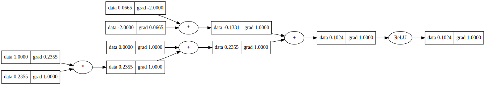

# Micrograd-MLP  
### A Minimal Autograd Engine & Deep Learning Library From First Principles

---

## Abstract

This repository presents a compact automatic differentiation engine and a neural network implementation built from scratch using pure Python.  
The system constructs a dynamic computational graph to support reverse-mode automatic differentiation (backpropagation).  
Using this framework, we train a multi-layer perceptron (MLP) to learn non-linear decision boundaries on challenging synthetic datasets.  
Unlike conventional deep-learning frameworks that rely on optimized tensor operations, this implementation operates at the scalar level — illustrating the fundamental mechanics of neural network training.

---

## Introduction

Automatic differentiation is a core component of modern deep learning.  
It enables efficient gradient computation through the chain rule of calculus.  
This project replicates that mechanism in a transparent and educational manner.

We implement:

- A **scalar autograd engine**
- A **neural network library**
- A training workflow for binary classification

This work demonstrates how neural networks learn non-linear functions by updating parameters via gradients computed through backpropagation.

---

---

# 🔍 Computational Graph Tracing & Visualization

Understanding backpropagation becomes significantly easier when the computational graph is visualized explicitly.

This project includes a visualization pipeline that renders the dynamically constructed computation graph using **Graphviz**.  
The visualization displays:

- Node values (forward pass outputs)
- Gradients (computed during backward pass)
- Mathematical operations
- Dependency connections between nodes

---

## 📓 Visualization Notebook

All visualization code is included inside: micrograd_mlp.ipynb

  

<b>Figure:</b> Dynamically constructed computational graph showing forward values and backward gradients produced by the autograd engine.

